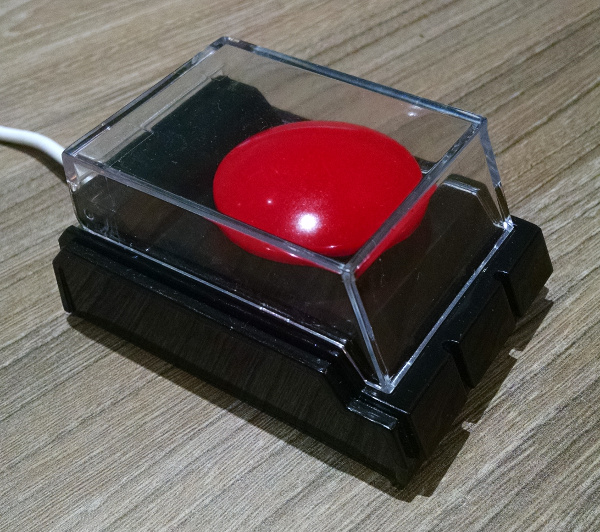

BONKERS!
========

Ever wish you could trigger actions by slamming your fist against a mighty Button of Doom?  Bonkers is a lightweight C program to monitor this style of devices.  When the button is pressed you are able to run command-line programs.  A little creativity and you can have your lights turn off, a thunderclap come from your speakers and computers.  You can use one of these supported devices:

* Dream Cheeky - Big Red Button (`1d34:000d`)
* Dream Cheeky - USB Fidget (`1d34:0001`)
* EB Brands (E&B Giftware, LLC) - USB ! Key (`1130:6626`)
* I'd happily accept patches for others!

 

Getting Started
---------------

This guide breaks down the installation procedure into very small steps.  When possible, I've included information for how to test that things are installed correctly.

### Prerequisites

You need to have `libusb-1.0` installed.  On Debian/Ubuntu systems you use `sudo apt-get install libusb-1.0-0-dev`.  Similar packages exist for other systems.

To make sure this worked, the file `/usr/include/libusb-1.0/libusb.h` should exist on your system.

### Device Permissions with udev

This step is optional.  It helps to have the permissions on the device changed when you plug it in.  This will let Bonkers communicate with the device without needing to run as root.  If you do not do this, you must use `sudo` or somehow run Bonkers with the right permissions to read the file.

Adding these lines is the easy way to do things.

1. As root, copy [`doc/99-bonkers.rules`](doc/99-bonkers.rules) to `/etc/udev/rules.d`.
2. Run `udevadm control --reload-rules`

Now we should test that it is working as expected.

1. Plug in a supported device.
2. Run `lsusb` and note the bus and device numbers.
3. Run `ls -l /dev/bus/usb/BUS_NUMBER/DEVICE_NUMBER` and confirm the permissions are set properly.

For reference, this is the one line of output from `lsusb` we care about when using the Big Red Button:

    Bus 003 Device 021: ID 1d34:000d Dream Cheeky Dream Cheeky Big Red Button

The important bits are the bus number and device number.  This means it created a node under `/dev/bus/usb/003/021`.  Simply use `ls -l /dev/bus/usb/003/021` (change the filename to match yours) and you should see something like this.

    crw-rw-rw- 1 root root 189, 276 Mar 27 17:30 /dev/bus/usb/003/021

You want it to say the "crw-rw-rw-" on the left.  If the mode matches then the udev rule was applied successfully.

### Compile

Check out the repository and `cd` into it.  Now start the build.

    make

It should have created a file called `bonkers`.  Let's test it out by running it.

    ./bonkers -v

This will start the program and will report events to the console.  The `-v` makes it very verbose as to what's going on.  There's a few nice features you can enable; check them out by running `./bonkers -h`.  Stop the program by pressing control-C.

Running Commands
----------------

Let's start with something easy.  Just echoing the result of what's happening, but disabling all other non-error output.

    ./bonkers -q -c "echo 'STATUS CHANGE'"

Run this for a bit and you'll see different messages.  Again, press control-C to quit.  My output for a Big Red Button (open the lid, press the button, stop pressing the button, close the lid) looks like this.

    STATUS CHANGE 15 00
    STATUS CHANGE 17 15
    STATUS CHANGE 16 17
    STATUS CHANGE 17 16
    STATUS CHANGE 15 17

Because I have a Big Red Button, I can hook into one of the example scripts in the repository.  Let's run this again with that script.

    ./bonkers -q -c examples/big-red-buton.sh

And the output from the same procedure:

    System is safe
    Weapons are armed - proceed with caution
    FIRE FIRE FIRE
    Cease fire
    System is safe

### Tying into udev

If you like, you can modify your `/etc/udev/rules.d/99-bonkers.rules` to run a command of your choice.  Let's copy `examples/udev.sh` and `bonkers` to `/usr/local/bin/`.  You'll likely need root privileges.

    sudo cp examples/udev.sh /usr/local/bin/
    sudo cp bonkers /usr/local/bin/"

Now edit `/usr/local/bin/udev.sh` as root and make sure it does what you want.  After that, edit `/etc/udev/rules.d/99-bonkers.rules`, look for your device and add a `RUN` section, like this:

    # Dream Cheeky - Big Red Button
    ACTION=="add", SUBSYSTEM=="usb", ATTR{idVendor}=="1d34", ATTR{idProduct}=="000d", MODE="0666", RUN+="/usr/local/bin/udev.sh"

Device Specific Codes
---------------------

Each device seems to want to send its own codes.  This software does not standardize them.

### Dream Cheeky - Big Red Button

* `00` - Only used as the previous code during initialization
* `14` - Button pressed and lid closed (difficult)
* `15` - Lid closed
* `16` - Button pressed and lid open
* `17` - Lid open

Normally you can assume that `15` is closing the lid and `16` is pressing the button.  When receiving `17` you must look at the previous code to determine the actions.  With `17` + `15` the lid was opened.  Receiving `17` + `16` indicates the button is no longer pressed.   Normally you will not get `14`.

### Dream Cheeky - USB Fidget

* `1E` - Button pressed

I don't have one of these yet so I am unable to thoroughly test that this type of button works.

### EB Brands - USB ! Key

* `00` - Button is not pressed.
* `68` - Button has been pressed.

This button does not continually send code `68`.  When held, the button flashes `68` and then goes back immediately to `00`.  It also appears that the hardware driving this button doesn't respond well to rapid-fire button presses.

License
-------

This code is licensed under an MIT license with an additional non-advertising clause.  Read the full text in [LICENSE.md](LICENSE.md).

Thanks!
-------

* Malcom Sparks authored an article for [OpenSensors.IO](http://blog.opensensors.io/blog/2013/11/25/the-big-red-button/) that explained a lot about the button and provided source code.
* Arran Cudbard-Bell wrote [big_red_button.c](https://gist.github.com/arr2036/9932438), which uses libusb.
* Derrick Spell wrote [dream-cheeky](https://github.com/derrick/dream_cheeky), which supported the USB Fidget.
* Jan Axelson's [generic HID example](http://www.microchip.com/forums/m340898.aspx) under Linux with libusb.
